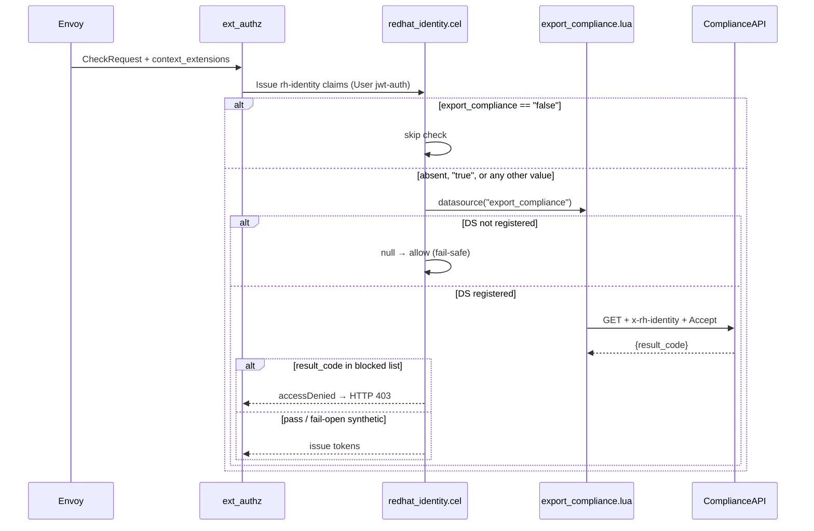

# RHCLOUD-49359: Export Compliance Check

**JIRA**: https://redhat.atlassian.net/browse/RHCLOUD-49359
**Status**: Implemented (awaiting PR)
**Author**: Adam O'Brien / AI Assistant
**Date**: 2026-08-21

## Context

Legacy `insights-3scale` rejects users subject to U.S. export restrictions
before granting platform access. Parsec currently has no compliance check. This
feature adds one using the established Lua DS + CEL pattern.

Parent epic: [RHCLOUD-43993](https://redhat.atlassian.net/browse/RHCLOUD-43993)
(SSO feature parity). Related:
[RHCLOUD-49315](https://redhat.atlassian.net/browse/RHCLOUD-49315)
(entitlements — **not a dependency**; see PR boundary below),
[RHCLOUD-47320](https://redhat.atlassian.net/browse/RHCLOUD-47320)
(cross-account, compliance must check original user identity first — AC9).

> **Note**: The JIRA mentions an `IssuancePolicy` interface from RHCLOUD-47315 —
> that interface was replaced before this ticket was written. Policy lives in CEL
> claim mappers per [`docs/issuance-policy.md`](../issuance-policy.md).

### Acceptance Criteria

- [x] AC1: Compliance runs for SSO bearer (`jwt-auth` + `User`) only; all other auth types skip it (including `cert-auth` / `x509://`, now on main)
- [x] AC2: HTTP GET to compliance service with `x-rh-identity` (base64-encoded identity JSON) + `Accept: application/json;charset=UTF-8`
- [x] AC3: Fail-open — any error, non-200, malformed JSON, or missing username → allow through
- [x] AC4: Reject with **403** only when result code matches a configured error code
- [x] AC5: **Opt-out** via Envoy `context_extensions.export_compliance` — schema default **`true`**, same as `auth_sso_jwt`. Check runs unless the value is `"false"`. Absent key / absent map → check **on**.
- [x] AC6: Cache by username; default TTL **24 hours**
- [x] AC7: Fail-open synthetic results are **never** cached under the username key; only real compliance responses are cached
- [x] AC8: Cache bypass via `x-rh-insights-gateway-use-compliance-cache: 0` request header — disables both reads and writes (bypass key includes the bypass header, so bypass and normal responses never share a cache slot)
- [x] AC9: For JWT auth, check the **original** user identity (before any cross-account swap in CEL) — compliance guard placed before cross-account logic
- [x] AC10: Configurable error codes (default: `ERROR_T5`, `ERROR_EXPORT_CONTROL`, `ERROR_OFAC`) — inline list in `redhat_identity.cel`

### External References

- [RHCLOUD-49359](https://redhat.atlassian.net/browse/RHCLOUD-49359)
- Gateway `context_extensions` names/defaults (Hartinger, 2026-08-20): https://docs.google.com/document/d/1oYGaq6ZJDKbNpJIFJFeZbx7AArqS3tOwvyqcdJRqz1Y/edit?tab=t.0
- Draft app-interface MR for those keys: https://gitlab.cee.redhat.com/service/app-interface/-/merge_requests/202748 (Hartinger updating names; GitLab fetch failed from this environment)
- [RHCLOUD-50414](https://redhat.atlassian.net/browse/RHCLOUD-50414) — env-specific values belong in namespace variables, not hardcoded in the parsec config template (`compliance_api` follows this)

**Locked from the doc table** (`context_extensions.<key>`):

| Key | Used by | Default | This PR |
|-----|---------|---------|---------|
| `auth_sso_jwt` | HCC, CRC | `true` | No — Envoy/authn, not compliance |
| `auth_tbr` | Pulp | `false` | No |
| `auth_sat` | TBD | TBD | No |
| `auth_cert` | HCC, Pulp, CRC | `true` | No — cert-auth already on main; AC1 skips it |
| `auth_uhc` | ingress only (HCC) | `false` | No |
| `entitlements` | handful of tenant apps | `false` (opt-in) | **No** — RHCLOUD-49315; different default |
| `export_compliance` | HCC, CRC | `true` (opt-out) | **Yes** — “should default consistently with `sso_jwt`” |

Envoy values are strings (`"true"` / `"false"`). Parsec does **not** AND compliance with `auth_sso_jwt` in CEL: that flag is the gateway authn toggle; AC1 already limits the check to User `jwt-auth`. Consistency with `sso_jwt` is the **schema default** (`true` on HCC/CRC), not a second CEL gate.

## Design

### Server Code vs. Configuration Gate

> **Answer these questions FIRST before proceeding with any design.**

| Question | Answer |
|----------|--------|
| Does this modify server Go code or use configuration/policy? | **Both**. Compliance logic is Lua DS + CEL. Generic Go: `OAuthAccessDenied` + 403 mapping, Lua `Base64Service` (needed to build `x-rh-identity`), and a slice-aware koanf env merge so indexed `PARSEC_DATA_SOURCES__N__…` overrides do not wipe YAML lists. |
| If server code: is the change generic or specific? | **Generic** — `access_denied` is RFC 6749 §4.1.2.1; base64 is a Lua runtime service; koanf merge applies to any indexed list. |
| Does any proposed server code hardcode claim names, issuer URLs, vendor behaviors, or deployment-specific logic? | **No** — claim paths, compliance URL, blocked codes, and the `export_compliance` extension name stay in Lua/CEL/config. |
| Which existing parsec policy/config layer fits? | Lua data source + CEL `datasource()` + Envoy `context_extensions`. |
| If none: does this need a new abstraction layer? | **No**. `Base64Service` is a small existing Lua helper (today it lives only on the entitlements branch). It ships **in this PR** because compliance needs it and entitlements is no longer a dependency. |

_Parsec is a generic service. Server code must never contain logic specific to
a particular IdP, vendor, or deployment. Use configuration/policy layers for
deployment-specific behavior._

### Approach



1. **Standalone PR, not stacked on entitlements.** Hartinger: entitlements still needs discussion on scaling across authn schemes; compliance must not wait. Current [PR 187](https://github.com/project-kessel/parsec/pull/187) includes RHCLOUD-49315 + RHCLOUD-49359 and must **not** be the merge vehicle.
2. **Opt-out gate (AC5).** Rename `enable_compliance` → `export_compliance`. Schema default `true`, same as `auth_sso_jwt`. Check runs when the extension is absent or `"true"`. Only `"false"` skips the HTTP call. Gateways that are not HCC/CRC (e.g. Pulp: `auth_tbr`, not in `export_compliance` “Used by”) must set `"false"` in Envoy — that lives in MR 202748, not in parsec Go.
3. **Fail-safe with opt-out.** `datasource()` already returns CEL `null` when the name is not in the registry. Guard with `datasource("export_compliance") != null && …result_code in […]` so a missing DS (app-interface not updated yet) preserves previous behavior (no check, no mapper error). New behavior activates when the DS is present.
4. **cert-auth is on main** (`x509://` System branch). AC1 still excludes it: compliance is SSO User `jwt-auth` only. Do not add a compliance call on the cert-auth branch.
5. **Cherry-pick onto `origin/main`.** Take the compliance commit plus the generic `Base64Service` files from the entitlements commit; strip every entitlements-specific hunk (`user_entitlements.lua`, `enable_entitlements` CEL, entitlements YAML/tests/docs).

### Alternatives Considered

| Alternative | Pros | Cons | Why not |
|-------------|------|------|---------|
| Keep opt-in `enable_compliance == "true"` | Matches original JIRA AC5; safer default-off | Contradicts the gateway table (`export_compliance` default `true`, same as `auth_sso_jwt`) | Rejected |
| AND CEL with `auth_sso_jwt == "true"` | Literal reading of “consistently with sso_jwt” | Second gate inside parsec; AC1 already scopes User jwt-auth | Rejected — consistency is the Envoy default, not a CEL predicate |
| Stack on entitlements PR 187 | Less cherry-pick work | Blocks compliance on entitlements authn-scheme discussion; meeting: Daniel still rebasing entitlements | Rejected — standalone |
| Split Base64Service into its own PR | Pure abstraction review | Extra cycle for ~50 lines; only motivated by `x-rh-identity` encoding | Same-PR — tiny generic helper, same rationale as the original entitlements plan |
| Opt-out without `!= null` DS guard | Simpler CEL | Missing DS → `.result_code` on null → mapper error (not fail-open) | Violates fail-safe; must null-guard |

### Interface Changes

None beyond what already landed on the stacked branch:

- `OAuthAccessDenied OAuthErrorCode = "access_denied"` + `accessDenied(message)` CEL (already implemented).
- Lua `Base64Service` (`base64.encode` / `base64.decode`) — currently only on the entitlements commit; **copy into this PR**.
- No new observer/probe types (Lua DS observer already records fetch).

### Package Impact

| Package | Change Type | Description |
|---------|------------|-------------|
| `internal/service` | Modified | `OAuthAccessDenied` (already on stacked branch) |
| `internal/server` | Modified | `access_denied` → 403 / PermissionDenied |
| `internal/cel` | Modified | `accessDenied` Layer A function |
| `internal/lua` | New (this PR) | `Base64Service` — currently lives on entitlements commit only |
| `internal/datasource` | Modified | Register `Base64Service` next to `URLService` (cert-auth) |
| `internal/trust` | Modified | Same Lua service registration on validators |
| `internal/config` | Modified | Slice-aware env merge so `PARSEC_DATA_SOURCES__N__CONFIG__COMPLIANCE_API` overlays list items instead of replacing `data_sources` |
| `configs/scripts` | New / Modified | `export_compliance.lua`; CEL opt-out on User jwt-auth branches only |
| `configs/` | Modified | Wire `export_compliance` DS; **do not** add `user_entitlements` |

## Implementation Steps

Work already exists on stacked branch `RHCLOUD-49359` / [PR 187](https://github.com/project-kessel/parsec/pull/187) (includes entitlements). **Do not merge 187 for this ticket.** Execute the steps below on a **new branch from `origin/main`**.

Merge of `origin/main` (cert-auth) into PR 187 is done locally (`3ebc560`) so 187 is no longer `DIRTY`; that does not change the standalone-PR plan.

### PR 1: Export compliance check (standalone)

This is the only PR for RHCLOUD-49359. Atomic with Base64Service: compliance Lua cannot encode `x-rh-identity` without it, and the helper is too small to justify a separate review cycle.

#### Step 1: New branch from `origin/main` + cherry-pick

**Status**: Done (`RHCLOUD-49359-standalone` from `origin/main`)

```text
git checkout -b RHCLOUD-49359-standalone origin/main
# Generic Lua helper (files only; skip entitlements script/CEL/YAML/tests)
git checkout 961cb78 -- internal/lua/base64.go internal/lua/base64_test.go
# Register Base64Service alongside existing URLService (do not drop URLService)
# Cherry-pick compliance commit and strip entitlements hunks
git cherry-pick 57cd5e9
```

Strip from the cherry-pick (must not land):

- `configs/scripts/user_entitlements.lua` and entitlements tests/docs
- CEL `enable_entitlements` / `datasource("user_entitlements")` branches
- `user_entitlements` data source in YAML / deploy / README
- Entitlements e2e (`test/e2e/hermetic_authz_entitlements_test.go`)
- `docs/impl-plans/RHCLOUD-49315.md`

Keep / add:

- `export_compliance.lua`, compliance unit + e2e tests
- `OAuthAccessDenied` / `accessDenied` / oauth 403 mapping
- `Base64Service` registration in `lua_datasource.go` **and** `lua_validator.go` (keep `URLService` from cert-auth)
- `export_compliance` DS in `configs/parsec.yaml` and `configs/examples/parsec-production.yaml`
- This plan file

**Key types/functions** (already named):

- `OAuthAccessDenied` — RFC 6749 §4.1.2.1
- `accessDenied(message)` — Layer A CEL
- `NewBase64Service` — Lua `base64.encode` / `base64.decode`

#### Step 2: Opt-out `context_extensions.export_compliance`

**Package**: `configs/scripts`
**Files**: `redhat_identity.cel`, `export_compliance.lua` (header comment)
**Status**: Done

Replace every `enable_compliance == "true"` guard with opt-out + null-safe DS:

```cel
!(has(request.additional.context_extensions)
    && "export_compliance" in request.additional.context_extensions
    && request.additional.context_extensions.export_compliance == "false")
&& datasource("export_compliance") != null
&& datasource("export_compliance").result_code in ["ERROR_T5", "ERROR_EXPORT_CONTROL", "ERROR_OFAC"]
  ? accessDenied("export compliance check failed")
  : { /* identity map */ }
```

`datasource()` is cached per mapper eval, so the double call is one fetch.

Apply on all three User jwt-auth branches (console, rhsm, portal). Do **not** add to cert-auth, registry-auth, or ServiceAccount.

Do **not** change entitlements gates in this PR (those files should not be present).

#### Step 3: Slice-aware env overlay for indexed data sources

**Package**: `internal/config`
**Files**: `merge.go` (new), `loader.go`, `loader_test.go`
**Status**: Done

Koanf’s default merge treats `PARSEC_DATA_SOURCES__2__CONFIG__COMPLIANCE_API` as a map keyed `"2"` and **replaces** the YAML `data_sources` list, leaving empty items (`unknown data source type:`). Overlay numeric-keyed maps onto slice indices instead.

This is generic (any indexed list env override). Needed so the documented `PARSEC_DATA_SOURCES__N__CONFIG__COMPLIANCE_API` override works.

**Test**: `TestNewLoader_EnvOverrideIndexedDataSourceConfig` — three YAML DS entries; env override of index 2 `compliance_api`; all names/types preserved.

#### Step 4: Tests for opt-out + fail-safe

**Files**: `test/e2e/hermetic_authz_compliance_test.go`, docs/comments in unit tests
**Status**: Done (cert-auth skip is CEL-only: no `datasource("export_compliance")` on the `x509://` branch; JWT e2e harness has no cert validator)

Flip e2e helpers from `enable_compliance: "true"` to the new semantics (see Test Plan).

#### Step 5: Docs + example YAML

**Files**: `configs/README.md`, `configs/parsec.yaml`, `configs/examples/parsec-production.yaml`, `internal/datasource/LUA_DATASOURCE.md`, `docs/issuance-policy.md` (already has `accessDenied` if cherry-pick includes it)
**Status**: Done

Document opt-out, the `"false"` skip value, and fail-safe when the DS is absent.

#### Step 6: Downstream app-interface (merge prerequisite)

**Status**: Follow-up (no parsec-repo code; required before **enforcing** in production; code is fail-safe without it)

Per [`.cursor/rules/deploy-config-sync.mdc`](../../.cursor/rules/deploy-config-sync.mdc):

- Add `export_compliance` DS + `export_compliance.lua` script mount to stage and prod app-interface secrets
- Set `compliance_api` as a **namespace variable**, not a hardcoded template value ([RHCLOUD-50414](https://redhat.atlassian.net/browse/RHCLOUD-50414))
- Envoy keys land in [MR 202748](https://gitlab.cee.redhat.com/service/app-interface/-/merge_requests/202748) (Hartinger updating names):
  - HCC / CRC: `export_compliance: "true"` (or omit; parsec treats absent as on)
  - Pulp / TBR / any gateway **not** in the doc’s “Used by” column: `export_compliance: "false"` **before** the DS is enabled — otherwise User jwt-auth on those routes starts calling compliance (Pulp is ~2M req/day)
- Until the DS is present: `datasource()` is null → previous behavior (no check)
- Once the DS is present: check is **on** for every User jwt-auth request that does not send `"false"`
- Confirm cache bypass header name (`x-rh-insights-gateway-use-compliance-cache`) with gateway team
- Do **not** add `entitlements` (default `false`) in this ticket — that is RHCLOUD-49315, and the doc name is `entitlements` not `enable_entitlements`

#### Step 7: Close or retarget PR 187

**Status**: Pending

After the standalone PR is up: do not merge 187 as-is. Either close it or strip it back to entitlements-only (RHCLOUD-49315 / PR 180). Leave entitlements discussion unblocked.

## Naming

| Entity | Name | Rationale |
|--------|------|-----------|
| OAuth code | `OAuthAccessDenied` | RFC 6749 §4.1.2.1; parallel to `OAuthInvalidRequest` |
| CEL function | `accessDenied` | Layer A; parallel to `invalidRequest`, `invalidSubject` |
| Data source | `export_compliance` | Matches feature name |
| Script | `export_compliance.lua` | Same |
| Config key | `compliance_api` | Parallel to `entitlements_api` |
| Context extension | `export_compliance` | Doc table key (not `enable_compliance`) |
| Skip value | `"false"` | Doc default is boolean `false` to disable; Envoy string |
| Default (absent or `"true"`) | check **on** | Same default as `auth_sso_jwt`; HCC/CRC |
| Cache group | `compliance-cache` | Unchanged |

## Test Plan

Per [`docs/testing.md`](../testing.md): hermetic, fixtures not mocks.

### Unit Tests

| Test | Package | What it verifies |
|------|---------|-----------------|
| `TestExchangeErrToAuthzDenial/access_denied_is_forbidden` | `internal/server` | AC4 |
| `TestAbortDecision_MatchesDenyConstructors/layer_a_access_denied` | `internal/cel` | AC4 |
| `TestCELMapper_LayerA/access_denied` | `internal/mapper` | AC4 |
| `TestExportComplianceLua_*` (existing 13) | `internal/datasource` | AC2–AC4, AC6–AC8 |
| `TestNewLoader_EnvOverrideIndexedDataSourceConfig` | `internal/config` | Env overlay does not wipe `data_sources` |

### E2E Tests (hermetic) — AC5 rewrite

| Test | What it verifies |
|------|------------------|
| `opt-out (export_compliance=false) does not call compliance service` | AC5 skip |
| `extension absent → check runs` (pass result → token issued) | AC5 default on |
| `export_compliance=true + pass result → token issued` | AC5 explicit on |
| `DS not registered + extension absent → token issued, no panic` | fail-safe / config-constraints |
| `gate on + ERROR_T5 → 403 denied` | AC4 |
| `gate on + ERROR_EXPORT_CONTROL → 403 denied` | AC4, AC10 |
| `gate on + ERROR_OFAC → 403 denied` | AC4, AC10 |
| `gate on + unknown result code → token issued` | AC10 |
| `gate on + compliance service down → fail-open` | AC3 |
| `service account: no compliance check` | AC1 |
| `cert-auth (x509://): no compliance check` | AC1 (now that cert-auth is on main) |

Helper `checkRequestWithBearerAndCompliance` becomes two helpers: opt-out (`"false"`) and default (no extension). Blocked-code cases use default (no extension) or `"true"`.

### Contract Tests

N/A — no new interfaces.

### Benchmarks

N/A — not on a new hot path beyond existing Lua DS fetch (already histogram’d).

## Observability

Per `docs/observer-pattern.md`. No new Observer/Probe types.

Existing Lua DS observer records `lua fetch completed` / errors on `export_compliance`. Mapper deny already logs `mapping.oauth_error=access_denied`.

### Injection

Unchanged: `NewLuaDataSource` accepts leaf `LuaObserver`.

## Security

- [x] Input validation: Lua fail-open on missing username / malformed JSON; CEL only denies on configured codes
- [x] Error handling: denial message is `export compliance check failed` — no upstream body leaked
- [x] Credential handling per `docs/CREDENTIAL_DESIGN.md`: check uses already-validated subject claims; no new credential type
- [x] TLS/mTLS: outbound compliance HTTP uses the DS `http` client spec (CA / timeout from config). No extra headers (no API token) per JIRA.

## Maintainability

- [x] Constructor pattern: `NewBase64Service()` no options; `NewLuaDataSource` already uses config struct
- [x] Forward compatibility: no new interfaces
- [x] Config vs. domain: blocked codes, URL, extension name stay in CEL/YAML/Lua
- [x] Downstream app-interface impact: **yes** — see Configuration Impact

## Configuration Impact

> **Fail-safe rule**: See [config-constraints.md](../../.claude/skills/parsec-impl/config-constraints.md). Absent fields must preserve previous behavior.

### Backward Compatibility

| New Field | Type | Default / Zero Value | Behavior When Absent |
|-----------|------|---------------------|----------------------|
| `data_sources[]` entry `export_compliance` | YAML list item | omitted | `datasource()` → null → CEL skips check (previous behavior) |
| `context_extensions.export_compliance` | `string` (Envoy) | omitted | Check **on** once DS is registered (intended opt-out) |
| `config.compliance_api` | `string` | `""` | Lua fail-open (synthetic allow) |

Opt-out vs fail-safe: Envoy default-on is the product default **after** the DS exists. Until app-interface adds the DS, CEL null-guards keep old behavior. That is the required two-phase rollout (code first, config second).

- [x] Every new field has a safe default that preserves prior behavior
- [x] No `panic` or `log.Fatal` on missing new config
- [x] Test verifies behavior with new field absent matches previous version (`DS not registered + extension absent`)

### Local Config (parsec repo)

| File | Change | Description |
|------|--------|-------------|
| `configs/parsec.yaml` | Add `export_compliance` DS | `ttl: 24h`, `in_memory`; **no** `user_entitlements` |
| `configs/examples/parsec-production.yaml` | Add `export_compliance` DS | `distributed` cache, `ttl: 24h` |
| `internal/config/loader.go` + `merge.go` | Env overlay | Indexed list merge |
| `configs/scripts/redhat_identity.cel` | Opt-out guard | `export_compliance != "false"` |

### Deploy Templates (parsec repo)

| File | Change | Description |
|------|--------|-------------|
| `deploy/parsec-ephem.yaml` | Only if ephem should enforce | Prefer omit (fail-safe) unless ephem mounts the Lua script + DS. Do **not** copy entitlements CEL from PR 187. |

### Downstream app-interface (follow-up required)

> **Action required after merge**: Update the downstream app-interface secrets
> to reflect config changes. Until updated, the new code runs with previous
> behavior (fail-safe). Once the DS is applied, the check is **on** unless a
> gateway sets `export_compliance: "false"`.
>
> Refer to `.cursor/rules/deploy-config-sync.mdc` for specific paths and
> validation checks for stage and prod environments.

| Environment | What to update |
|-------------|----------------|
| Stage | DS + script; `compliance_api` namespace var; Envoy: `"true"`/omit on HCC+CRC, `"false"` on Pulp/TBR (MR 202748) |
| Prod | Same, after stage validation |

## Documentation

### New Documentation

None. Pattern already documented (`LUA_DATASOURCE.md`, `issuance-policy.md`).

### Documentation Updates

| Doc | Path | What changes |
|-----|------|-------------|
| Config README | `configs/README.md` | Opt-out semantics, example YAML, smoke test with absent vs `"false"` |
| Lua DS | `internal/datasource/LUA_DATASOURCE.md` | Pointer + gate name |
| Issuance policy | `docs/issuance-policy.md` | Already lists `accessDenied` if cherry-pick includes it |
| This plan | `docs/impl-plans/RHCLOUD-49359.md` | This revision |

### Config Examples

```yaml
# configs/parsec.yaml — DS present; Envoy opt-out is per-request
- name: export_compliance
  type: lua
  script_file: ./configs/scripts/export_compliance.lua
  config:
    compliance_api: "https://export-compliance.example.internal/v1/compliance"
  http:
    timeout: 5s
  caching:
    type: in_memory
    ttl: 24h
    group_name: compliance-cache
```

Envoy `context_extensions` (same family as `auth_sso_jwt` / `auth_cert` / `entitlements`):

```yaml
# HCC / CRC (default on — consistent with auth_sso_jwt):
context_extensions:
  auth_sso_jwt: "true"
  export_compliance: "true"   # or omit; parsec treats absent as on

# Pulp / TBR (not in export_compliance "Used by"):
context_extensions:
  auth_tbr: "true"
  export_compliance: "false"
```

## Completeness Checklist

- [x] **Server code vs. configuration gate passed**: no IdP/vendor/deployment-specific logic in Go
- [x] Base64Service ships in this PR (needed; entitlements is not a dependency) — not a new policy layer
- [x] Every acceptance criterion maps to at least one implementation step
- [x] Every new exported type/function has a proposed name following parsec conventions
- [x] No new interfaces (NoOp N/A)
- [x] Observable via existing Lua DS observer
- [x] Test cases cover opt-out, default-on, missing DS, blocked codes, fail-open, SA + cert-auth skip
- [x] Security implications addressed
- [x] Documentation steps included
- [x] Config impact assessed: local, deploy, app-interface
- [x] New config fields fail-safe (DS absent → no check)
- [x] Test exists verifying behavior with new config field absent
- [x] Explicit follow-up for app-interface stage + prod
- [x] Single standalone PR; compiles and does not include entitlements
- [x] Plan can be executed top-to-bottom without ambiguity

## Risks & Open Questions

| # | Item | Status | Resolution |
|---|------|--------|------------|
| 1 | Claim-shape duplication recurs (Risk #7 from RHCLOUD-49315) | Open / track | Follow-up JIRA for `datasource(name, params)` |
| 2 | Cache bypass header name | Confirm before enabling | `x-rh-insights-gateway-use-compliance-cache` |
| 3 | `access_denied` semantics | Accepted | RFC 6749 §4.1.2.1 close enough for policy denial |
| 4 | CEL ordering vs cross-account (RHCLOUD-47320) | Verify later | Guard stays before identity map output |
| 5 | Google Doc names/defaults | **Resolved** | Table: `export_compliance` default `true` (HCC, CRC), skip `"false"`; `entitlements` is a different key defaulting `false` |
| 6 | Opt-out + missing DS | Resolved | `datasource() != null` short-circuit |
| 7 | PR 187 currently stacks entitlements | Resolved (plan) | New branch from `origin/main`; 187 not the merge vehicle; meeting: Daniel rebasing entitlements separately |
| 8 | Pulp (~2M req/day) not in “Used by” | Open | MR 202748 must set `export_compliance: "false"` on those routes before the DS is enabled, or they inherit default-on |
| 9 | AND with `auth_sso_jwt`? | Resolved | No. Schema default matches; CEL stays AC1 (User jwt-auth) + `export_compliance != "false"` |

## Review Log

| Date | Reviewer | Feedback | Changes Made |
|------|----------|----------|--------------|
| 2026-08-19 | Adam O'Brien | Implementation complete on stacked branch | Steps 1–7 of original plan |
| 2026-08-21 | Jozef Hartinger | Align context_extensions names/defaults; `export_compliance` should be **opt-out** | AC5 rewritten; CEL guard + tests + docs; fail-safe via null DS |
| 2026-08-21 | Jozef Hartinger | Cherry-pick as a standalone PR; do not block on entitlements authn-scheme scaling | PR boundary: new branch from `origin/main`; Base64Service copied into this PR; strip entitlements |
| 2026-08-21 | — | `origin/main` (cert-auth) conflicted with PR 187 | Merge commit `3ebc560` on `RHCLOUD-49359`: keep both `Base64Service` and `URLService` |
| 2026-08-21 | — | Execute standalone PR | Branch `RHCLOUD-49359-standalone` from `origin/main`; Base64Service + opt-out CEL + slice-aware env merge; entitlements not included |
